```
 █████╗ ███╗   ███╗██╗████████╗██╗  ██╗██████╗ ██╗  ██╗██╗   ██╗███████╗
██╔══██╗████╗ ████║██║╚══██╔══╝██║ ██╔╝██╔══██╗╚██╗██╔╝╚██╗ ██╔╝╚══███╔╝
███████║██╔████╔██║██║   ██║   █████╔╝ ██████╔╝ ╚███╔╝  ╚████╔╝   ███╔╝ 
██╔══██║██║╚██╔╝██║██║   ██║   ██╔═██╗ ██╔══██╗ ██╔██╗   ╚██╔╝   ███╔╝  
██║  ██║██║ ╚═╝ ██║██║   ██║   ██║  ██╗██║  ██║██╔╝ ██╗   ██║   ███████╗
╚═╝  ╚═╝╚═╝     ╚═╝╚═╝   ╚═╝   ╚═╝  ╚═╝╚═╝  ╚═╝╚═╝  ╚═╝   ╚═╝   ╚══════╝
```

[Gists](https://gist.github.com/amitkrxyz)

<!--
[](https://gist.github.com/amitkrxyz/ebd202becdc8d33bd10aff480d665adf/)
-->





                                                                            

<!--
**amitkrxyz/amitkrxyz** is a ✨ _special_ ✨ repository because its `README.md` (this file) appears on your GitHub profile.

Here are some ideas to get you started:

- 🔭 I’m currently working on ...
- 🌱 I’m currently learning ...
- 👯 I’m looking to collaborate on ...
- 🤔 I’m looking for help with ...
- 💬 Ask me about ...
- 📫 How to reach me: ...
- 😄 Pronouns: ...
- ⚡ Fun fact: ...
-->
